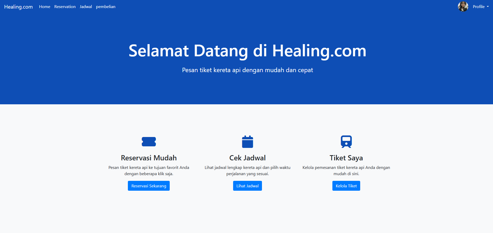
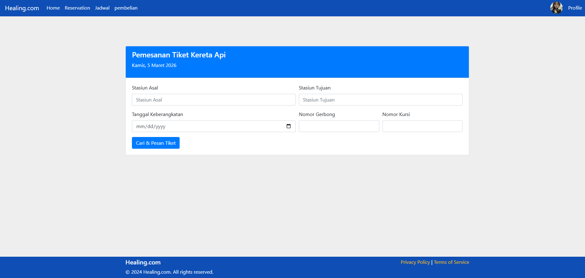
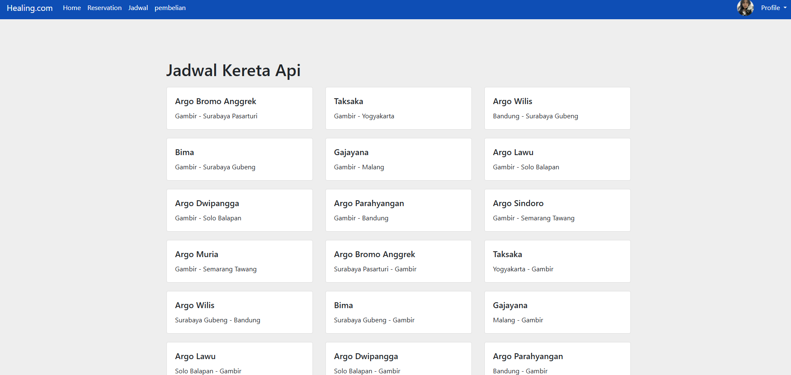
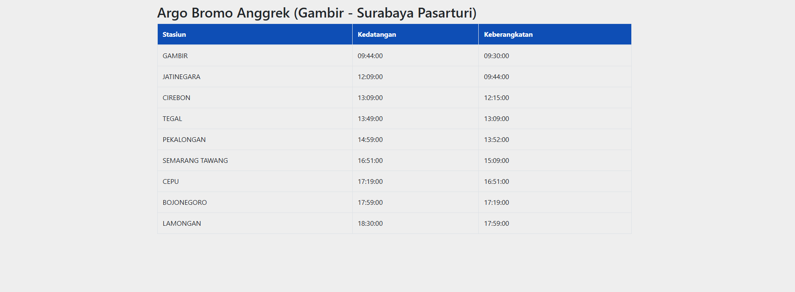

# Healing.com - Website Pemesanan Tiket Kereta Api

## Deskripsi
Healing.com adalah aplikasi web pemesanan tiket kereta api secara online. Pengguna dapat registrasi, login, melihat jadwal kereta, melakukan reservasi, dan mengelola tiket yang sudah dipesan.

## Fitur Utama
- Registrasi dan login pengguna.
- Reservasi tiket kereta api.
- Lihat jadwal kereta.
- Kelola data pembelian/tiket.
- Dashboard admin untuk mengelola penumpang, kereta, jadwal, stasiun, dan pembelian.

## Teknologi
- PHP (native)
- MySQL / MariaDB
- HTML, CSS, JavaScript
- Bootstrap 4

## Struktur Singkat Project
- `Kereta/` : source code aplikasi web.
- `images/` : screenshot tampilan aplikasi.
- `keretaapi.sql` / `Kereta/kereta_api.sql` : dump database.

## Cara Menjalankan (Local)
1. Letakkan project di folder web server (contoh `htdocs` pada XAMPP).
2. Jalankan Apache dan MySQL.
3. Buat database baru bernama `kereta_api`.
4. Import salah satu file SQL:
   - `keretaapi.sql`, atau
   - `Kereta/kereta_api.sql`
5. Pastikan konfigurasi koneksi database di `Kereta/koneksi.php` sesuai:
   - host: `localhost`
   - user: `root`
   - password: `` (kosong/default XAMPP)
   - database: `kereta_api`
6. Akses aplikasi melalui browser:
   - Landing page: `http://localhost/Project_Website_Penjualan_Tiket_Kereta/Kereta/index.html`
   - Login page: `http://localhost/Project_Website_Penjualan_Tiket_Kereta/Kereta/login.php`

## Akun Admin Default
- Email: `admin@admin.com`
- Password: `admin`

## Screenshot Aplikasi
> Screenshot diambil dari folder `images`.

### Home

### Reservasi

### Jadwal

### Jadwal (Detail)

